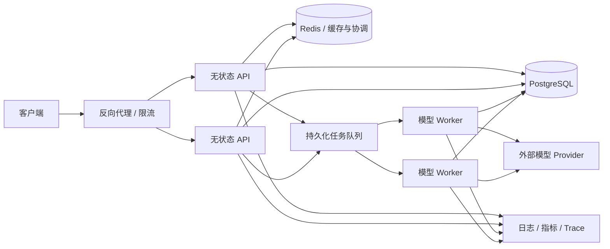

# textree 后端工程化与高流量演进路线

## 1. 文档目的

本文档用于指导 textree 在产品核心功能与 UI 稳定后，逐步从“单用户、本地优先应用”演进为一个具有后端工程证明力的项目。

路线的目标不是堆叠 PostgreSQL、Redis、Celery、Kubernetes 等名词，而是形成一条可验证的工程链路：

```text
业务不变量
→ 正确性测试
→ 单机性能基线
→ 定位真实瓶颈
→ 有理由地引入基础设施
→ 故障与并发验证
→ 形成可复现报告
```

项目只有在能够说明“遇到了什么问题、为什么这样设计、怎样证明有效”时，才真正具有后端含金量。

## 2. 项目定位

### 2.1 当前定位

textree 当前是一个本地优先的树形学习应用，核心能力包括：

- 树形学习会话与父子节点关系；
- 回答节点下固定的验收、追问、自定义三分支；
- 当前路径、最近上下文与子树查询；
- 子树事务删除；
- 大模型 Provider 调用；
- 持久化任务记录与前端轮询；
- 节点隐藏、收起、布局与导出；
- Markdown、TXT、DOCX 多格式导出。

### 2.2 目标定位

目标不是虚构“超高并发平台”，而是将项目建设为：

> 一个能够保证树形数据一致性、可靠处理异步模型任务、在明确硬件和负载条件下提供可复现性能数据，并能解释从单机到多实例演进过程的后端系统。

### 2.3 非目标

以下内容不应在缺少实际需求和测量证据时提前引入：

- 为了简历而迁移微服务；
- 没有多实例需求时引入 Kubernetes；
- 没有热点证据时缓存所有接口；
- 没有任务可靠性设计时直接接入复杂消息中间件；
- 使用真实付费模型进行大规模压测；
- 未经测量就在简历中填写 QPS、延迟或可用性数字。

## 3. 已验证的当前架构

### 3.1 代码边界

- API 路由：[api.py](../src/textree/blueprints/api.py)
- 应用创建与依赖装配：[app.py](../src/textree/app.py)
- 数据访问与事务：[store.py](../src/textree/services/store.py)
- 模型 Provider：[provider.py](../src/textree/services/provider.py)
- 学习方法规则：[methodology.py](../src/textree/services/methodology.py)
- 导出：[exporter.py](../src/textree/services/exporter.py)
- 节点笔记验证：[note_validator.py](../src/textree/services/note_validator.py)
- 前端收起解析测试：[fold-state.test.js](../tests/fold-state.test.js)

### 3.2 已存在的工程能力

当前源码已经包含：

- SQLite 外键约束；
- WAL 日志模式；
- `busy_timeout`；
- `BEGIN IMMEDIATE` 显式写事务；
- 子树事务删除；
- 分支创建事务；
- 配额更新事务；
- 持久化任务表；
- `ThreadPoolExecutor` 异步执行；
- Provider 超时与错误封装；
- 未完成任务恢复处理；
- API、存储、Provider、方法论和导出职责分层。

### 3.3 当前主要边界

- 系统定位为单用户本地应用；
- SQLite 在高并发写入下存在单写者边界；
- 任务执行器位于应用进程内部；
- 多进程或多实例之间不能共享线程池任务；
- 后端自动化测试体系尚不完整；
- 尚无正式负载测试与容量数据；
- 尚无 Docker、CI、结构化日志、指标与生产健康检查闭环；
- 尚未证明并发创建分支、重复提交和任务恢复的完整正确性。

## 4. 后端价值判断标准

### 4.1 高流量不等于高价值

大量静态页面访问可能主要由 CDN 处理，不能直接证明后端能力。textree 更有价值的流量是有状态业务流量：

```text
创建问题
→ 校验父节点和分支槽位
→ 原子写入节点与任务
→ 异步调用模型
→ 更新任务状态
→ 写入回答节点
→ 查询、轮询、导出和恢复
```

### 4.2 项目价值等级

| 状态 | 证明力 |
|---|---|
| 只声称“支持高并发” | 很低，可能减分 |
| 使用数据库、缓存和队列但无测量 | 一般 |
| 有可复现负载测试和瓶颈分析 | 较高 |
| 有并发正确性、故障注入和恢复验证 | 很高 |
| 有真实流量、监控数据和线上问题复盘 | 极高 |

### 4.3 每项性能结论必须回答

1. 在什么硬件和软件环境测量？
2. 使用什么数据规模和请求比例？
3. 测量的是 API、数据库还是模型 Provider？
4. p50、p95、p99 延迟分别是多少？
5. 错误率和超时率是多少？
6. 数据一致性是否仍然成立？
7. 系统瓶颈在哪里？
8. 改造前后有什么可复现差异？

## 5. 实施阶段总览

| 阶段 | 核心结果 | 是否必须 |
|---|---|---|
| Phase 0 | 后端正确性测试矩阵 | 必须 |
| Phase 1 | 可部署、可观察、可重复验证 | 必须 |
| Phase 2 | 可靠异步任务状态机 | 必须 |
| Phase 3 | 单机负载基线和瓶颈报告 | 必须 |
| Phase 4 | 基于证据的数据层与任务层演进 | 条件触发 |
| Phase 5 | 多用户、安全与资源授权 | 公开部署时必须 |
| Phase 6 | 高流量、故障与容量验证 | 进阶目标 |
| Phase 7 | 简历材料和面试证据整理 | 必须 |

## 6. Phase 0：建立后端正确性底座

### 6.1 目标

在进行任何高并发改造前，先证明当前系统的业务不变量是正确的。

### 6.2 测试范围

#### 会话

- 创建和读取会话；
- 历史会话排序与分页；
- 会话归档；
- 不存在的会话；
- 用户数据隔离。

#### 节点和树

- 创建根节点；
- 创建子节点；
- 非法父节点；
- 父节点跨会话；
- 三分支上限；
- 同类分支重复创建；
- 当前路径顺序；
- 最近上下文截断；
- 子树删除；
- 删除失败后的完整回滚；
- 删除处理中任务关联的节点。

#### 任务

- 创建任务；
- pending → running → completed；
- pending → running → failed；
- Provider 超时；
- Provider 返回无效响应；
- 服务恢复未完成任务；
- 重复轮询；
- 重复完成任务不产生两个回答节点。

#### 配额和导出

- 配额关闭和开启；
- 配额并发扣减；
- 完整树、当前路径、当前子树导出；
- 空树和非法节点导出。

### 6.3 并发测试重点

重点复现：

```text
两个请求同时向同一回答创建相同分支
```

验证结果必须满足：

- 最多一个请求成功；
- 不突破三分支上限；
- 不产生孤立节点；
- 任务和用户节点要么同时存在，要么同时不存在；
- 错误响应可识别且稳定。

### 6.4 完成标准

- 建立 20～30 个高价值后端测试，而不是追求表面覆盖率；
- 关键事务和状态机路径有明确测试；
- CI 能重复执行测试；
- 所有后续架构改造都以这些测试为回归门槛。

## 7. Phase 1：工程化与可部署性

### 7.1 交付物

- Dockerfile；
- 可选 Docker Compose；
- 环境变量示例；
- 生产启动命令；
- `/health/live` 存活检查；
- `/health/ready` 就绪检查；
- CI 自动执行 Python、JavaScript 测试和静态检查；
- 数据备份与恢复说明；
- API 错误响应规范；
- 请求 ID 和结构化日志。

### 7.2 日志字段

建议至少包含：

- request_id；
- session_id；
- node_id；
- job_id；
- route；
- status_code；
- elapsed_ms；
- provider；
- provider_elapsed_ms；
- error_code；
- retry_count。

禁止记录：

- API Key；
- 完整凭证；
- 不必要的完整用户问题；
- 原始敏感数据。

### 7.3 完成标准

新环境能够按照 README 一次启动，并能通过健康检查、测试和一次完整学习请求。

## 8. Phase 2：可靠异步任务状态机

### 8.1 目标状态模型

```text
pending
  ↓ claim
running
  ├─→ completed
  ├─→ retry_wait → pending
  ├─→ failed
  └─→ cancelled
```

每次状态变化都应定义：

- 谁可以执行；
- 前置状态；
- 原子更新条件；
- 更新时间；
- 失败原因；
- 是否允许重试；
- 重复执行如何幂等。

### 8.2 必要能力

- 客户端幂等键或服务端去重键；
- 有上限的自动重试；
- 指数退避与随机抖动；
- 明确的 Provider 超时；
- 任务租约或心跳；
- Worker 崩溃后的重新领取；
- 重复完成任务不重复生成回答；
- 队列积压保护；
- 每用户和全局并发限制；
- 取消和过期策略；
- 失败任务查询与人工重放入口。

### 8.3 当前线程池的保留条件

若仍为单机本地应用，可以保留 `ThreadPoolExecutor`，但必须：

- 明确其单机边界；
- 将任务状态与执行逻辑解耦；
- 通过测试证明重启恢复和幂等；
- 避免把它描述为分布式队列。

### 8.4 引入外部队列的触发条件

满足任一条件时再评估 RQ、Celery、RabbitMQ、Redis Streams 或数据库队列：

- API 需要多实例部署；
- 模型 Worker 需要独立扩缩容；
- 任务积压需要跨进程领取；
- 需要可靠重试、定时任务或死信处理；
- 进程重启造成不可接受的任务损失或恢复复杂度。

## 9. Phase 3：建立单机性能基线

### 9.1 测试原则

大规模测试默认使用 Mock Provider，避免：

- 产生大量模型费用；
- 将第三方模型吞吐误认为本系统吞吐；
- 被外部限流干扰结果；
- 向外部服务发送测试数据。

真实 Provider 只做小规模集成测试，验证超时、错误、重试和费用。

### 9.2 负载模型

至少区分：

1. 只读负载：会话、节点、路径查询；
2. 混合负载：读取为主、少量节点和任务写入；
3. 写入竞争：同一回答节点下并发创建分支；
4. 任务负载：大量任务创建、轮询和完成；
5. 导出负载：不同规模树的导出；
6. 恢复负载：存在大量 pending/running 任务时重启。

### 9.3 数据规模

至少准备：

- 小树：约 30 个节点；
- 中树：约 100 个节点；
- 大树：约 500 个节点；
- 多会话数据集；
- 热点会话和均匀会话两种分布。

以上规模是测试档位，不是提前承诺的系统容量。

### 9.4 报告字段

```text
测试日期：
Git commit：
硬件：
操作系统：
Python/数据库版本：
API 实例数：
Worker 数：
数据库连接设置：
数据规模：
请求比例：
并发数：
持续时间：
吞吐量：
p50 / p95 / p99：
错误率：
CPU / 内存：
任务积压峰值：
正确性检查结果：
首个瓶颈：
```

### 9.5 性能测试后的正确性检查

- 没有超过三条分支；
- 没有重复回答；
- 没有孤立节点；
- 没有跨用户数据读取；
- 所有成功任务都有对应回答；
- 所有失败任务都有稳定错误状态；
- 子树删除结果完整；
- 配额没有被并发绕过。

## 10. Phase 4：基于证据演进数据层和任务层

### 10.1 SQLite → PostgreSQL 的触发条件

只有出现以下证据时迁移：

- 写锁竞争成为主要瓶颈；
- 多实例需要共享生产数据库；
- 需要更成熟的连接池、并发控制和运维工具；
- 路径或子树查询需要数据库级递归查询能力；
- 数据迁移与版本管理成为实际需求。

迁移时需要：

- 正式 schema migration；
- 连接池；
- 索引评估；
- 唯一约束；
- 事务隔离和重试策略；
- 迁移前后数据一致性校验；
- 备份与回滚路径。

### 10.2 树形数据模型评估

当前邻接表结构应与以下方案比较：

| 模型 | 优点 | 代价 | 适用条件 |
|---|---|---|---|
| 邻接表 | 写入简单、直观 | 深路径和子树依赖递归 | 当前默认 |
| 物化路径 | 路径/子树查询方便 | 移动子树更新复杂 | 读多写少 |
| 闭包表 | 祖先后代查询快 | 存储和写入成本高 | 路径查询极多 |

除非压测证明路径查询是瓶颈，否则保留邻接表。

### 10.3 Redis 的合理用途

Redis 只能在明确需求下用于：

- 限流计数；
- 幂等键；
- 短期任务状态；
- 热点会话缓存；
- 分布式任务协调；
- 短期锁或租约。

不得在缺少缓存命中率和失效策略时缓存全部接口。

## 11. Phase 5：多用户、安全和资源授权

如果项目公开部署，必须增加：

- 用户认证；
- session/node/job 资源级授权；
- CSRF 或相应请求防护；
- 输入长度和类型验证；
- 导出权限；
- 每用户限流；
- API Key 安全存储；
- 日志脱敏；
- 跨用户访问测试；
- 数据删除与备份策略。

如果继续保持本地单用户定位，应在 README 和架构文档中明确这是主动设计选择，而不是遗漏。

## 12. Phase 6：高流量与故障验证

### 12.1 目标架构草图



这是条件触发后的目标模型，不是当前已经实现的架构。

### 12.2 背压

必须处理“入口速度高于模型处理速度”的情况：

```text
请求到达速率 > Worker 完成速率
→ 队列持续增长
→ 等待时间和成本失控
```

需要验证：

- 队列长度上限；
- 单用户并发上限；
- 全局并发上限；
- Provider 并发上限；
- 超载快速失败；
- 等待时间估计；
- 任务优先级；
- 费用预算保护；
- 服务降级策略。

### 12.3 故障注入矩阵

| 故障 | 预期行为 |
|---|---|
| Worker 执行中退出 | 任务租约过期后可重新领取，不重复回答 |
| Provider 超时 | 进入有限重试或明确失败状态 |
| Provider 限流 | 退避，不形成重试风暴 |
| 数据库短暂不可用 | 请求失败可识别，事务不产生半状态 |
| Redis 不可用 | 明确降级或快速失败，不静默破坏一致性 |
| API 实例退出 | 其他实例继续服务 |
| 重复提交 | 返回同一结果或稳定冲突，不重复扣费 |
| 轮询风暴 | 限频、缓存或切换推送方案 |

### 12.4 可观测指标

#### API

- 请求量；
- p50、p95、p99；
- 4xx/5xx；
- 活跃连接；
- 数据库连接池等待。

#### 任务

- 各状态任务数量；
- 队列等待时间；
- 执行时间；
- 重试次数；
- 失败率；
- 租约过期数；
- 队列积压增长速度。

#### Provider 与成本

- 调用次数；
- 成功率和超时率；
- Provider 延迟；
- 输入/输出 Token；
- 单任务成本；
- 用户和全局费用预算。

#### 数据正确性

- 分支冲突数；
- 幂等命中数；
- 孤立节点检测；
- 任务与回答不一致数；
- 恢复任务数量。

## 13. API 演进建议

### 13.1 统一错误模型

```json
{
  "error": {
    "code": "tree_branch_slot_used",
    "message": "这个分支已经被使用",
    "request_id": "...",
    "retryable": false
  }
}
```

### 13.2 幂等提交

创建问题或任务时接受幂等键：

```text
Idempotency-Key: <client-generated-id>
```

服务端需要明确：

- 键的作用域；
- 有效时间；
- 请求参数不一致时的行为；
- 第一次请求仍在处理时的返回；
- 完成结果的复用方式。

### 13.3 轮询优化

当前轮询在小规模下简单可靠。只有测量证明轮询造成明显压力时，再考虑：

- 指数退避轮询；
- `Retry-After`；
- 长轮询；
- Server-Sent Events；
- WebSocket。

## 14. 成本控制

### 14.1 不需要购买巨大服务器

项目证明可以通过以下方式完成：

- Docker Compose 本地多实例；
- Mock Provider；
- Locust 或 k6 生成流量；
- 人为限制 Worker、连接池和 CPU，观察瓶颈；
- 小规模云环境验证部署；
- 对比改造前后的资源消耗和延迟。

### 14.2 模型成本控制

- 大规模压测禁止调用真实模型；
- 集成测试设置调用预算；
- 将模型吞吐和后端吞吐分别报告；
- 记录 Token 和单任务成本；
- 超载时避免无界排队和重试风暴。

## 15. 防止过度设计的决策门

引入新组件前必须填写：

```text
当前问题：
复现方法：
基线数据：
候选方案：
为什么现有方案不足：
新组件解决的具体瓶颈：
引入的复杂度：
回滚方案：
验证指标：
```

如果无法填写“复现方法”和“基线数据”，默认不引入新组件。

## 16. 最终交付证据清单

### 16.1 仓库

- [ ] 完整 README；
- [ ] 架构图；
- [ ] API 文档；
- [ ] 数据模型说明；
- [ ] 状态机说明；
- [ ] Docker 启动方案；
- [ ] CI；
- [ ] 后端测试；
- [ ] 负载测试脚本；
- [ ] 性能报告；
- [ ] 故障注入报告；
- [ ] 安全边界；
- [ ] 架构决策记录。

### 16.2 演示

- [ ] 正常创建学习树；
- [ ] 展示三分支约束；
- [ ] 展示异步任务；
- [ ] 展示任务失败和恢复；
- [ ] 展示重复提交幂等；
- [ ] 展示 Worker 退出后任务重新领取；
- [ ] 展示压测指标；
- [ ] 展示优化前后对比。

### 16.3 严禁未经验证的表述

- “支持百万用户”；
- “高可用”；
- “零数据丢失”；
- “支持高并发”；
- “生产级”；
- “性能提升 X%”；
- “可用性 99.99%”。

只有真实测量和明确条件可以支持这些表述。

## 17. 简历表达方向

### 17.1 项目简介

> 设计并实现树形学习会话后端，通过事务约束维护三分支节点不变量；使用持久化任务状态机隔离大模型调用，并支持失败恢复、路径上下文构建、子树事务删除和多范围导出。

### 17.2 可用要点

- 设计邻接表树形数据模型，支持路径查询、子树删除与受限分支，通过显式事务维护并发写入下的结构一致性；
- 构建持久化异步任务状态机，将模型调用与 HTTP 请求解耦，支持轮询、失败记录、恢复和幂等处理；
- 使用数据库约束、WAL、超时与事务处理竞争写入，并为关键不变量建立并发与故障测试；
- 建立 Mock Provider 负载测试，测量 API、数据库与任务系统的吞吐、尾延迟和积压，依据瓶颈进行架构演进；
- 抽象模型 Provider 与方法论层，支持错误归一化、上下文裁剪、调用预算和多范围导出。

所有数字应在完成压测后替换为真实结果。

## 18. 面试讲解主线

准备闭卷讲清下面的因果链：

```text
为什么选择树形会话
→ 三分支不变量如何落到数据库
→ 并发请求如何产生竞争
→ WAL 与写事务解决了什么、没解决什么
→ 为什么模型调用需要异步任务
→ 进程崩溃后任务如何恢复
→ 如何防止重复回答和重复扣费
→ 子树删除为什么必须事务化
→ 单机方案的边界在哪里
→ 什么证据触发 PostgreSQL、Redis 和外部队列
→ 如何证明改造有效
```

### 18.1 必须能回答的问题

1. 为什么不用普通消息列表？
2. 为什么树使用邻接表？
3. 两个并发请求如何争抢同一分支？
4. `BEGIN IMMEDIATE` 的收益和代价是什么？
5. WAL 改善了什么，为什么不能解决所有写并发问题？
6. 线程池任务在进程退出时会怎样？
7. 任务至少一次执行时怎样避免重复回答？
8. 为什么不直接加入 Redis、Celery 和 Kubernetes？
9. 怎样区分模型 Provider 瓶颈与本系统瓶颈？
10. 性能提高以后，怎样证明数据仍然正确？

## 19. 推荐执行顺序

### 近期：产品核心完成后

1. 停止继续进行低收益视觉微调；
2. 建立后端测试矩阵；
3. 增加 Docker、CI 和健康检查；
4. 完善日志和错误模型；
5. 建立 Mock Provider 单机基线。

### 中期：根据基线结果

1. 优化数据库热点与索引；
2. 增加任务幂等、租约和重试；
3. 形成第一份性能报告；
4. 做 Worker 崩溃和 Provider 超时故障测试。

### 远期：公开部署或多实例需求出现后

1. 引入正式认证与授权；
2. 评估 PostgreSQL；
3. 评估持久化任务队列；
4. 评估 Redis 限流、幂等和热点缓存；
5. 进行多实例负载和故障验证；
6. 更新架构决策与简历数据。

## 20. 验证状态

### 已确认

- 项目包含树形领域模型、事务写入、子树删除、异步任务和 Provider 分层；
- 当前架构适合单机、本地优先使用；
- 当前主要缺口是后端测试、可靠任务、可部署性、可观测性和性能证据；
- UI 完成度可以提升演示效果，但不能替代后端工程证据。

### 尚未验证

- 当前系统的实际吞吐量和尾延迟；
- SQLite 的首个真实竞争瓶颈；
- 任务积压速度和恢复时间；
- 100～500 节点数据规模下的查询和导出性能；
- 多实例架构的必要性；
- PostgreSQL、Redis 或外部任务队列能够带来的实际收益。

### 下一检查点

产品核心 UI 完成后，从 Phase 0 开始，为分支约束、子树删除、任务状态机和配额建立第一批后端测试。只有这些测试稳定后，才开始负载测试和架构演进。

## 21. Open Questions

- 项目最终保持本地单用户，还是公开部署为多用户服务？
- 是否需要保存长期模型调用成本和 Token 数据？
- 是否允许同一会话内多个模型任务并行？
- 任务的顺序性要求是什么？
- 用户重复提交相同问题时应复用结果还是创建新节点？
- 大规模树的主要使用模式是读取路径、读取子树还是浏览全树？
- 公开部署后的隐私和数据删除要求是什么？

